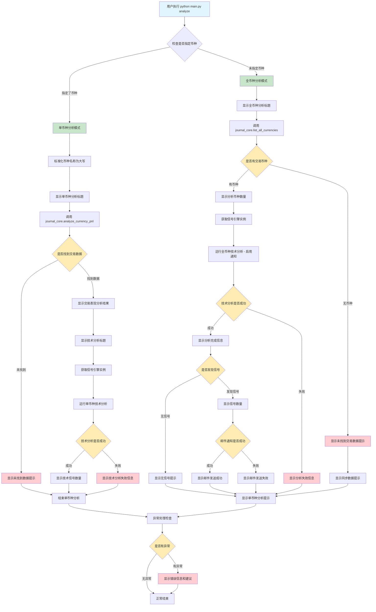

```mermaid
flowchart TD
    A[用户执行 python main.py analyze] --> B{检查是否指定币种}

    B -->|指定了币种| C[单币种分析模式]
    B -->|未指定币种| D[全币种分析模式]

    C --> E[标准化币种名称为大写]
    E --> F[显示单币种分析标题]
    F --> G[调用 journal_core.analyze_currency_pnl]

    G --> H{是否找到交易数据}
    H -->|找到数据| I[显示交易表现分析结果]
    H -->|未找到| J[显示未找到数据提示]

    I --> K[显示技术分析标题]
    K --> L[获取信号引擎实例]
    L --> M[运行单币种技术分析]

    M --> N{技术分析是否成功}
    N -->|成功| O[显示技术信号数量]
    N -->|失败| P[显示技术分析失败信息]

    D --> Q[显示全币种分析标题]
    Q --> R[调用 journal_core.list_all_currencies]

    R --> S{是否有交易币种}
    S -->|有币种| T[显示分析币种数量]
    S -->|无币种| U[显示未找到交易数据提示]

    T --> V[获取信号引擎实例]
    V --> W[运行全币种技术分析 - 启用通知]

    W --> X{技术分析是否成功}
    X -->|成功| Y[显示分析完成信息]
    X -->|失败| Z[显示分析失败信息]

    Y --> AA{是否发现信号}
    AA -->|发现信号| BB[显示信号数量]
    AA -->|无信号| CC[显示无信号提示]

    BB --> DD{邮件通知是否成功}
    DD -->|成功| EE[显示邮件发送成功]
    DD -->|失败| FF[显示邮件发送失败]

    U --> GG[显示同步数据提示]
    J --> HH[结束单币种分析]
    O --> HH
    P --> HH

    CC --> II[显示单币种分析提示]
    EE --> II
    FF --> II
    Z --> II
    GG --> II

    HH --> JJ[异常处理检查]
    II --> JJ

    JJ --> KK{是否有异常}
    KK -->|有异常| LL[显示错误信息和建议]
    KK -->|无异常| MM[正常结束]

    LL --> MM

    style A fill:#e1f5fe
    style C fill:#c8e6c9
    style D fill:#c8e6c9
    style H fill:#ffecb3
    style S fill:#ffecb3
    style N fill:#ffecb3
    style X fill:#ffecb3
    style AA fill:#ffecb3
    style DD fill:#ffecb3
    style KK fill:#ffecb3
    style U fill:#ffcdd2
    style J fill:#ffcdd2
    style P fill:#ffcdd2
    style Z fill:#ffcdd2
    style LL fill:#ffcdd2
```
