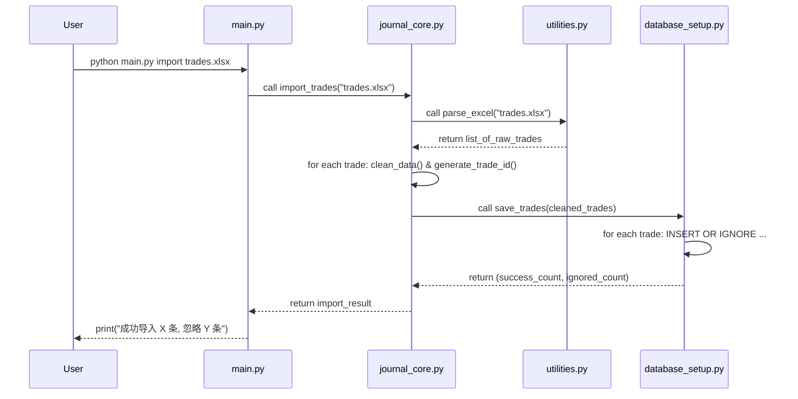
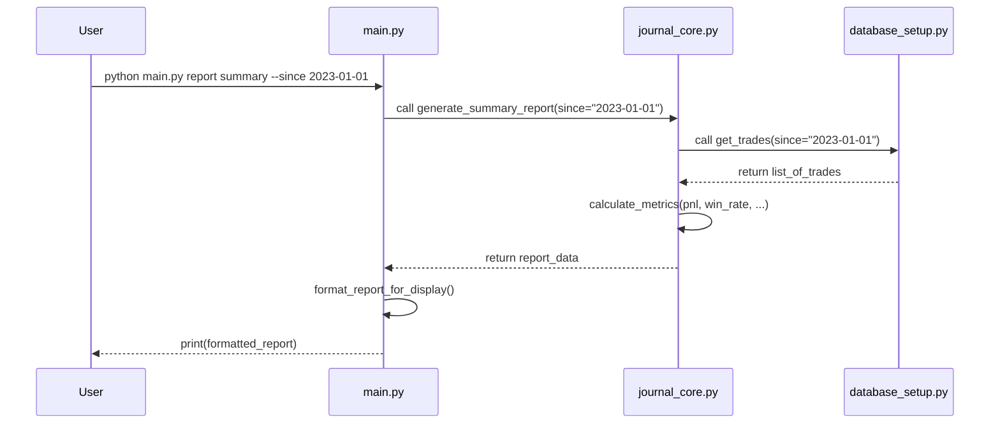

# CLI 工具架构设计

本文档阐述了 `trading-journal-cli` (MVP版本) 的架构设计、核心模块职责以及数据模型。

## 1. 设计哲学

-   **简单性 (Simplicity):** 遵循KISS原则，避免过度设计。每个模块只做一件事并把它做好。
-   **模块化 (Modularity):** 清晰划分模块边界，降低耦合度，便于独立开发和测试。
-   **数据中心化 (Data-Centric):** 所有功能都围绕核心数据（交易记录）展开，以SQLite数据库作为单一事实来源。
-   **无状态 (Stateless):** 核心业务逻辑是无状态的。相同的输入（数据库状态+命令参数）总是产生相同的输出，不依赖于应用缓存或会话。

## 2. 架构分层

我们将项目代码 (`2_Source_Code/`) 划分为以下几个逻辑层次：

```mermaid
graph TD
    A[用户 (Terminal)] --> B{main.py: 命令行接口层};
    B --> C{journal_core.py: 业务逻辑层};
    C --> D{utilities.py: 数据处理/工具层};
    C --> E{database_setup.py: 数据访问层};
    E --> F[(trading_journal.db)];
    D --> F;
```

-   **命令行接口层 (CLI Layer - `main.py`):**
    -   **职责:** 解析用户在终端输入的命令和参数。
    -   **技术:** 使用 `argparse` 或 `click` 库。
    -   **功能:** 它是所有功能的入口，根据解析到的命令，调用业务逻辑层的相应函数，并格式化输出最终结果给用户。它不包含任何业务逻辑。

-   **业务逻辑层 (Business Logic Layer - `journal_core.py`):**
    -   **职责:** 实现产品的核心功能，如计算报告、处理导入逻辑等。
    -   **功能:** 包含`generate_summary_report()`, `import_trades()`等核心函数。它负责协调数据处理和数据访问，是整个应用的大脑。核心算法的详细设计（如PnL计算）请参考 [核心业务逻辑设计](CORE_LOGIC.md)。

-   **数据处理/工具层 (Utility Layer - `utilities.py`):**
    -   **职责:** 提供与具体业务无关的、可重用的工具函数。
    -   **功能:** 包括解析Excel文件、数据清洗、格式转换、计算单个指标（如盈亏比）等。

-   **数据访问层 (Data Access Layer - `database_setup.py`):**
    -   **职责:** 封装所有与数据库的直接交互（SQL操作）。
    -   **功能:** 定义数据库表结构（Schema）、提供数据库初始化、插入、查询等函数。业务逻辑层通过调用此处的函数来操作数据，而不是直接编写SQL语句。

## 3. 数据模型 (Database Schema)

我们在 `trading_journal.db` 中定义一个核心表 `trades`。

**`trades` 表结构:**

| 字段名 (Field)     | 类型 (Type) | 约束 (Constraint) | 描述 (Description)                       |
| ------------------ | ----------- | ----------------- | ---------------------------------------- |
| `id`               | INTEGER     | PRIMARY KEY       | 唯一标识符，自增主键                     |
| `trade_id`         | TEXT        | UNIQUE            | 基于交易数据生成的唯一哈希，用于防止重复导入 |
| `utc_time`         | DATETIME    | NOT NULL          | 交易发生时间 (UTC)                       |
| `symbol`           | TEXT        | NOT NULL          | 交易对, e.g., 'BTCUSDT'                  |
| `side`             | TEXT        | NOT NULL          | 'BUY' 或 'SELL'                          |
| `price`            | REAL        | NOT NULL          | 成交价格                                 |
| `quantity`         | REAL        | NOT NULL          | 成交数量 (基础货币)                      |
| `quote_quantity`   | REAL        | NOT NULL          | 成交额 (报价货币)                        |
| `fee`              | REAL        | NOT NULL          | 手续费                                   |
| `fee_currency`     | TEXT        | NOT NULL          | 手续费币种, e.g., 'BNB'                  |
| `pnl`              | REAL        | NULLABLE          | 该笔交易的已实现盈亏                     |

**设计说明:**
-   使用 `trade_id` 而不是简单的组合键来确保唯一性，可以简化去重逻辑，通常我们会用交易时间、交易对、数量等关键信息生成一个SHA256哈希值。
-   `pnl` 字段设计为可空，因为盈亏计算（尤其是对于现货交易）通常是配对（一个BUY和一个SELL）完成的，单笔交易可能无法立即计算出盈亏。

## 4. 核心工作流程

### 数据导入流程



### 报告生成流程

